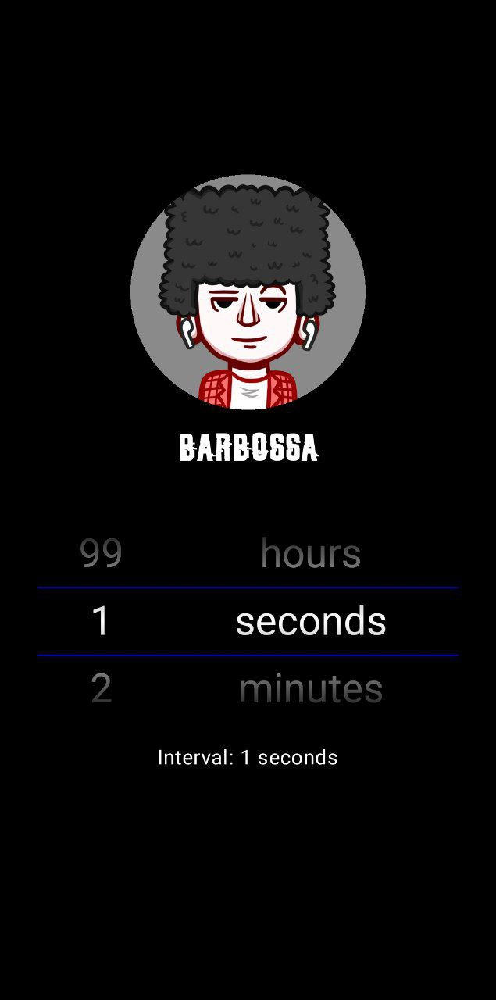

# Produced by Barbossa


# ScreenShot



# Setup
Add the JitPack repository to settings.gradle file
```gradle
dependencyResolutionManagement {
    repositoriesMode.set(RepositoriesMode.FAIL_ON_PROJECT_REPOS)
    repositories {
        ...      
        maven { url 'https://jitpack.io' }
    }
}
```

Add the dependencies to app-level build.gradle file
```gradle
dependencies {
    ...
    implementation 'com.github.barbossa-dev:ComposeScrollPicker:1.0.9'
}
```


